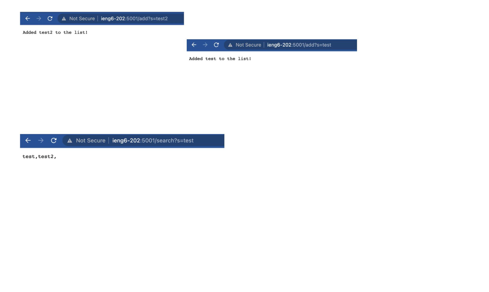

# Lab 2
## Long Tran


**Code for Search Engine**

```
import java.io.IOException;
import java.net.URI;

class Handler implements URLHandler {
    // The one bit of state on the server: a number that will be manipulated by
    // various requests.
    String[] things = new String[10];

    public String handleRequest(URI url) {
        if (url.getPath().equals("/add")) {
            String[] parameters = url.getQuery().split("=");
            if (parameters[0].equals("s")) {
                for (int i = 0; i < things.length; i++) {
                    if (things[i] == null) {
                        things[i] = parameters[1];
                        return String.format("Added %s to the list!", parameters[1]);
                    }
                }
            }
        } else {
            System.out.println("Path: " + url.getPath());
            if (url.getPath().contains("/search")) {
                String[] parameters = url.getQuery().split("=");
                if (parameters[0].equals("s")) {
                  String[] results = new String[10];
                  for (int i = 0; i < things.length; i++) {
                    if (things[i] != null && things[i].contains(parameters[1])) {
                      results[i] = things[i];
                    }
                  }
                  // only return the non null values
                  String ret = "";
                  for (int i = 0; i < results.length; i++) {
                    if (results[i] != null) {
                      ret += results[i] + ",";
                    }
                  }
                  return ret;
                }
            }
            
        }
        return "404 Not Found!";
    }
}

class SearchEngine {
    public static void main(String[] args) throws IOException {
        if(args.length == 0){
            System.out.println("Missing port number! Try any number between 1024 to 49151");
            return;
        }

        int port = Integer.parseInt(args[0]);

        Server.start(port, new Handler());
    }
}
```

**Screenshot of using search engine**


The handleRequest method is called. It looks at the URL query string. If it's an add
request, it extracts the relevant string and adds ti to the array. fI it's a search request, it matches the string from the request to the strings in the array and then return the strings that match the request.

**Part 2**

Part 2:
I chose the reverselnPlace method from Lab 3.

Input that doesn't induce an error: The empty list

Input that does induce an error: `(3, 4, 5}`

Running the test:


Before:

```
static void reverselnPlace(int[] arr) {
  for(int i = 0; i < arr.length; i+=1){
    arr[i] = arr[arr.length - i - 1];
  }
}
```

After:

```
static void reverseInPlace(int[] arr){
  for(int i = 0; i < arr.length / 2; i++){
    int temp = arr[i];
    arr[i] = arr[arr.length - i - 1];
    arr[arr.length - i - 1] = temp;
  }
}
```

**Part 3**
In week 2 or 3, I learned about the importance of test-driven development and writing unit tests to ensure the correctness of the code. It was interesting to see how writing tests before implementing the actual code can help catch errors early on and ensure the code is more robust and reliable.