# Lab 4
## Long Tran

**Key Pressed:** ``ssh cs15lsp23bm@ieng6.ucsd.edu <enter>`` this command create an SSH connection with the server so I can do work on it.

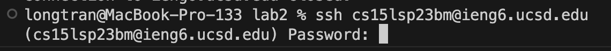

**Key Pressed** ``My password <enter>`` I typed in my password to log into the server with my account.

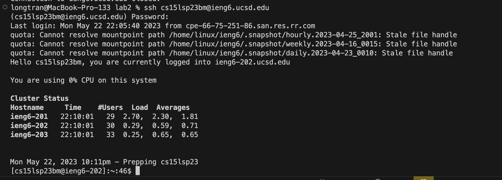

**Key Pressed:** ``git clone https://github.com/longforu/lab7 <enter>`` I'm using git clone to clone my repository.

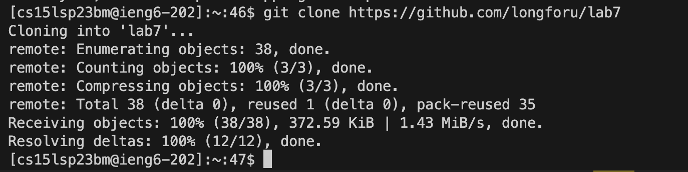

**Key Pressed:** ``cd lab7 <enter>`` Entering the lab7 folder in the workspace.

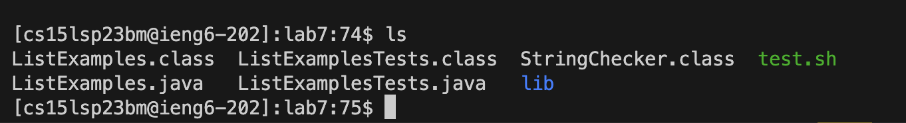

**Key Pressed:** ``ls <enter>`` Examining the files in the folder.

**Key Pressed:** ``chmod 777 ./test.sh <enter>`` Changing the permission of the test script so I can run it.

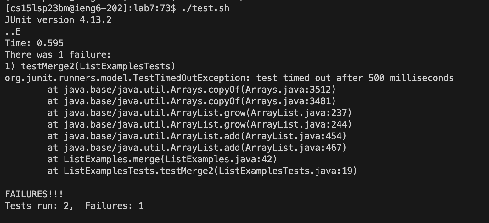

**Key Pressed:** ``./test.sh <enter>`` Run the test script, demonstrating that it failed.

**Key Pressed:** ``vim ListExamples.java <enter>`` This open the file we need to fix in Vim.

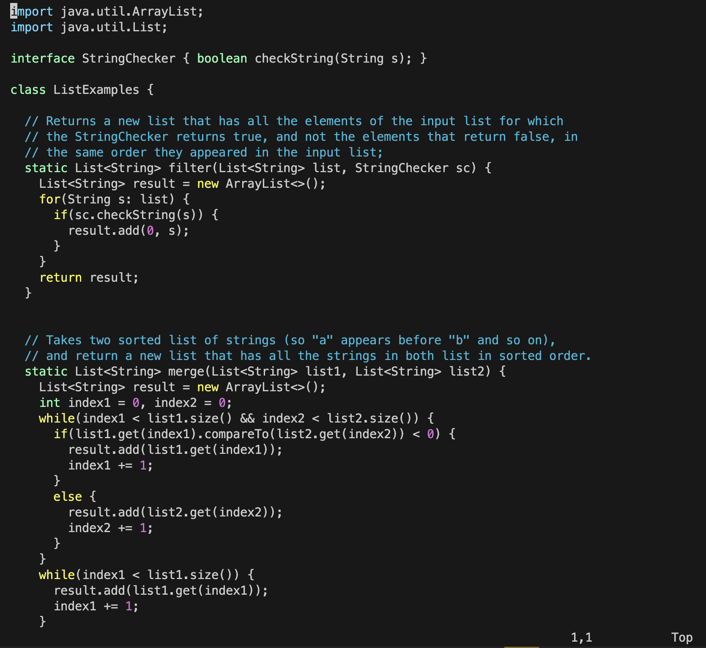

**Key Pressed:** `j` (repeated 43 times) I pressed `j` 43 times to get down to the line that needs fixing.

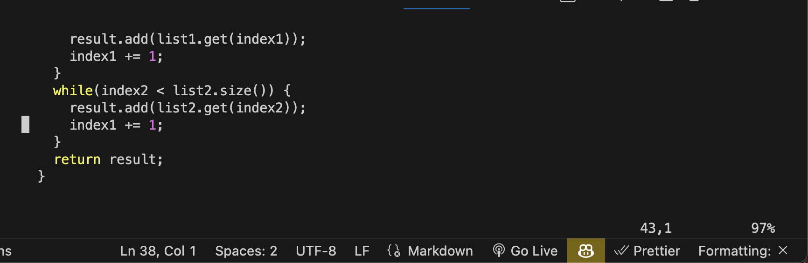 

**Key Pressed** `l` (repeated 11 times) I pressed `l` 11 times to get to the character that needs fixing

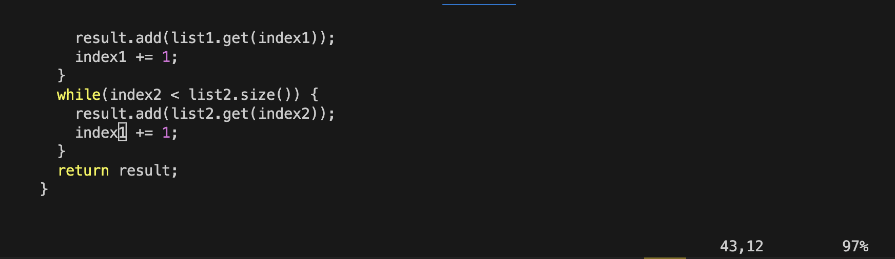

**Key Pressed:** `x i 2 <esc>` I pressed x to delete the erroneous character. Then I press i to go into insert mode and then insert a 2 to fix the bug. I then press escape to go back to normal mode.

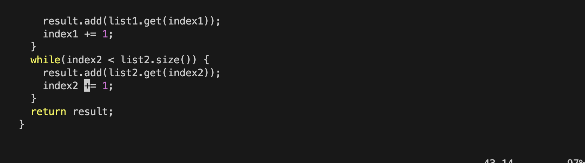

**Key Pressed:**  `:wq! <enter>` This sequence save the file in vim.

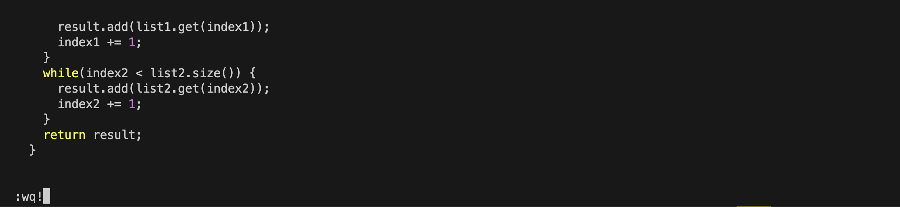

**Key Pressed:** `./test.sh <enter>` Confirm that the test now run correctly.

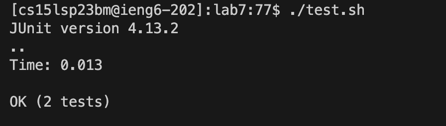

**Key Pressed:** `git add . <enter>` Add the changes we made to the git working tree.

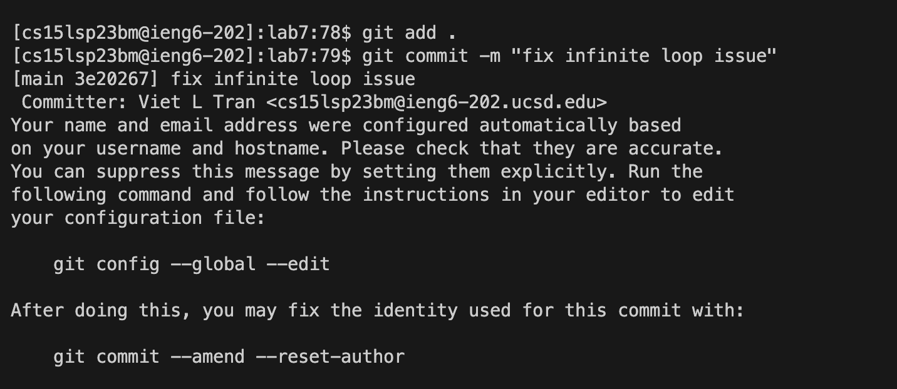

**Key Pressed:** `git commit -m "fix infinite loop issue" <enter` Commit the changes we have into the main branch.

**Key Pressed:** `git push origin main <enter` We now push the changes we have to the repo.

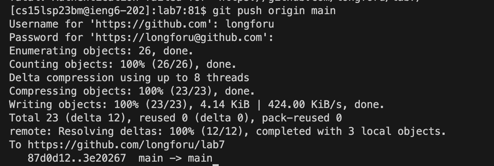

**Key Pressed:** `longforu <enter> [PAT] <enter>` I have to authenticate into my github account because it's my first time commiting remotely. After authorizing the commit works fine.

