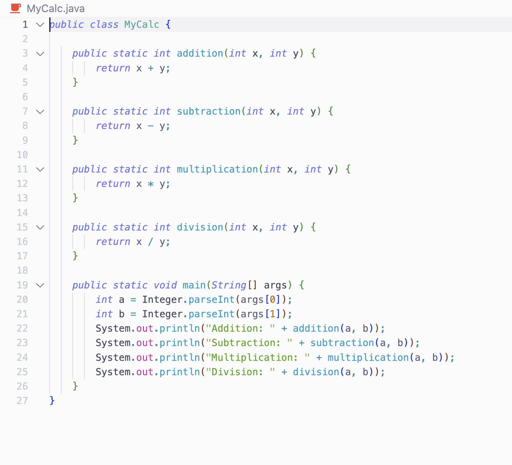
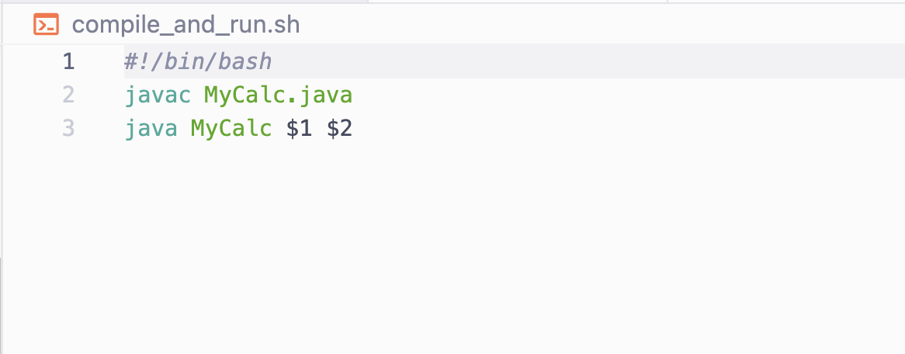
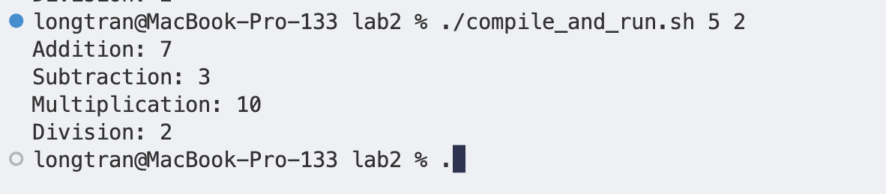
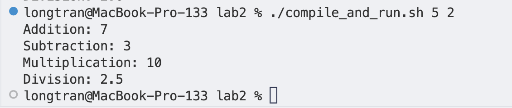
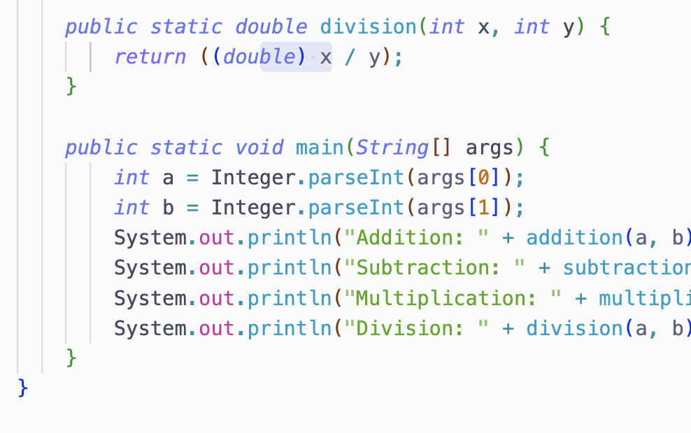

# Lab Report 5
## Long Tran

## The Original Post

**What environment are you using (computer, operating system, web browser, terminal/editor, and so on)?**

I am running on a 2020 Macbook Pro inside the Visual Studio Code terminal.


**Detail the symptom you're seeing. Be specific; include both what you're seeing and what you expected to see instead. Screenshots are great, copy-pasted terminal output is also great. Avoid saying “it doesn't work”.**

This is my code:



I also have a Bash script to compile and run this.



I expect that when I run this code with the input 5 and 2, the division should print out a 2.5. However, it printed out a 2.



The addition, subtraction, and multiplications are all correct. I'm not sure why the division is not working. I suspect that the reason is that there is something wrong with converting the command line input in the script.

**Detail the failure-inducing input and context. That might mean any or all of the command you're running, a test case, command-line arguments, working directory, even the last few commands you ran. Do your best to provide as much context as you can.**

The failure-inducing input is the command line arguments. I'm not sure why it's not working. I suspect that it's because I'm not converting the command line arguments correctly. It is "5" and "2".

The directory includes only the 2 files I showed above.

## TA Comment

Hello, thank you so much for the bug report. This does not seems like a problem with the bash script command line argument. This seems like a problem with data type in division. In general, division involving 2 integers in Java will result in an integer. For example, 5/2 will result in 2. To fix this, you can cast the integer to double and return that. Please let me know if you have any questions. Thank you.

## My Response

Thank you for the help. I have fixed the bug. Here is the new result when running the command.



Here is the new code.



The bug was that I was dividing 2 integers, which resulted in an integer. I fixed this by casting the integers to doubles before dividing them. This way, the result is a double. I also changed the return type of the function to double. Division should return a double, not an integer.

## Set Up

Directory Structure:
2 files: MyCalc.java and compile_and_run.sh

Files (Before Fix):

**MyCalc.java**

```java
public class MyCalc {

    public static int addition(int x, int y) {
        return x + y;
    }

    public static int subtraction(int x, int y) {
        return x - y;
    }

    public static int multiplication(int x, int y) {
        return x * y;
    }

    public static int division(int x, int y) {
        return x / y;
    }

    public static void main(String[] args) {
        int a = Integer.parseInt(args[0]);
        int b = Integer.parseInt(args[1]);
        System.out.println("Addition: " + addition(a, b));
        System.out.println("Subtraction: " + subtraction(a, b));
        System.out.println("Multiplication: " + multiplication(a, b));
        System.out.println("Division: " + division(a, b));
    }
}
```

**compile_and_run.sh**

```bash
#!/bin/bash
javac MyCalc.java
java MyCalc $1 $2
```

Command ran to trigger the bug:

```bash
chmod 777 ./compile_and_run.sh
./compile_and_run.sh 5 2
```

Files (After Fix):

```java
public class MyCalc {

    public static int addition(int x, int y) {
        return x + y;
    }

    public static int subtraction(int x, int y) {
        return x - y;
    }

    public static int multiplication(int x, int y) {
        return x * y;
    }

    public static double division(int x, int y) {
        return (double) (x / y);
    }

    public static void main(String[] args) {
        int a = Integer.parseInt(args[0]);
        int b = Integer.parseInt(args[1]);
        System.out.println("Addition: " + addition(a, b));
        System.out.println("Subtraction: " + subtraction(a, b));
        System.out.println("Multiplication: " + multiplication(a, b));
        System.out.println("Division: " + division(a, b));
    }
}
```

Description of the fix: I casted the integers to doubles before dividing them. This way, the result is a double. I also changed the return type of the function to double. Division should return a double, not an integer.

## Reflection

In the second half of this quarter, I learned the importance of modular programming and how breaking down a complex problem into smaller, manageable tasks can significantly improve code organization and ease debugging. I also gained exposure to new programming concepts, such as remote server debugging, which allowed me to tackle problems from unique angles.